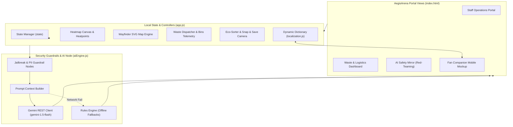
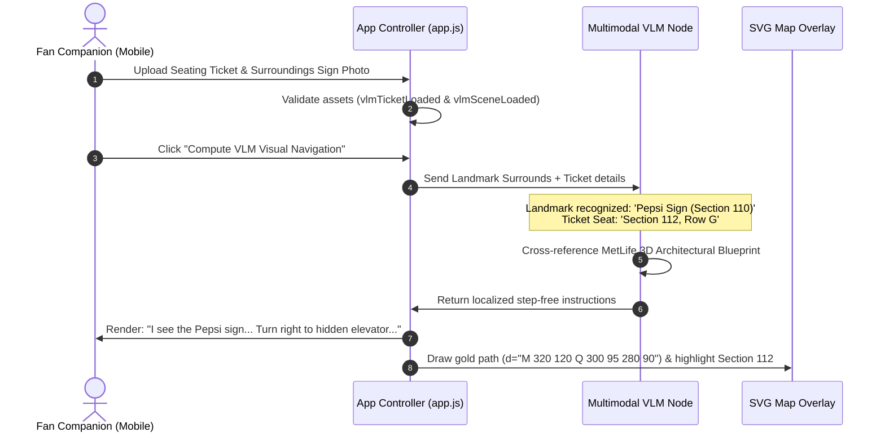
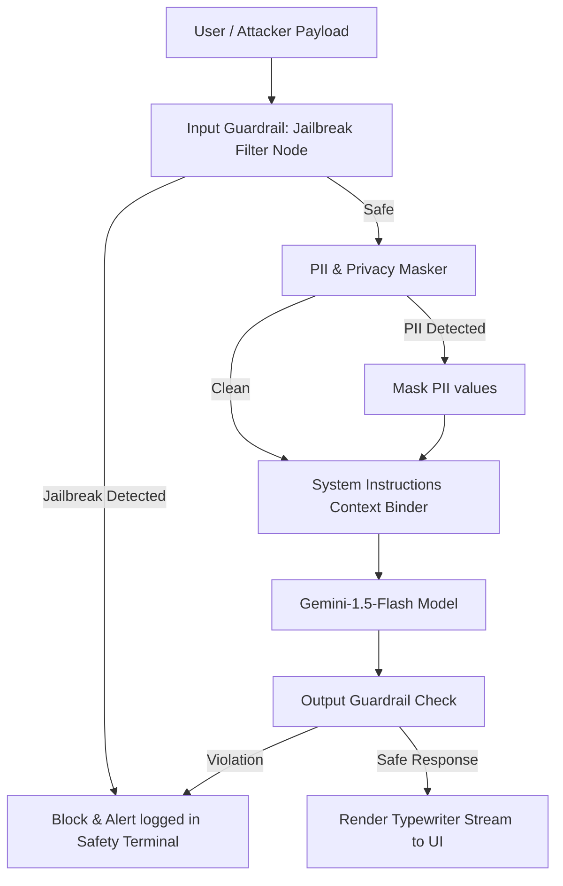

# AegisArena FIFA 2026 🏆
### GenAI Stadium Operations Command Center & Fan Companion Portal

AegisArena is a premium, GenAI-enabled stadium management and tournament companion platform built for the **FIFA World Cup 2026** at MetLife Stadium. The application features a desktop dashboard for operations personnel (incorporating waste logistics and real-time AI security red-teaming benchmarks) alongside a smartphone companion web application for fans (supporting VLM-guided barrier-free navigation, gamified recycling, and snap-to-clean concessions perks).

---

## 🗺️ System Architecture

The following diagram illustrates how the frontend components, state engines, localization layers, and AI safety middleware communicate with the Google Gemini API:



---

## 👁️ VLM Visual Landmark Escort Workflow

Rather than relying on inaccurate GPS coordinates inside concrete stadium bowls, fans can upload visual landmarks to calculate customized, barrier-free routes:



---

## 🛡️ AI Safety Mirror (Jailbreak Defense Flow)

To ensure secure deployments, the platform contains an adversarial sandbox evaluating prompt safety before forwarding context to Gemini:



---

## ✨ Features Checklist

### 1. Staff Operations Portal
*   **Live Match Telemetry**: Dynamic tracking loops matching wait times, security distributions, and gate checking checks.
*   **Live Interactive Map**: An HTML5 `<canvas>` heatmap of MetLife Stadium. Clicking a hotzone automatically starts AI diagnostic scans.
*   **Operations Copilot Terminal**: System-instructions-bound chatbot that recommends crowd dispatches and creates live queues nodes.

### 2. Fan Companion App Mockup
*   **Multilingual AI Assistant**: Streaming typewriter answers translated across **English, Español, Français, Arabic, and Japanese**.
*   **Dynamic Localization**: A centralized translation manager (`localization.js`) that translates all wayfinder routes, transit schedules, and game cards.
*   **Eco-Sorter Game**: A gamified material classifier teaching fans sustainability concepts with immediate AI feedback logs.
*   **Snap & Save**: Fans scan their seat area before and after the game to earn Eco-points, protect ticket pre-sale ratings, and unlock 15% concession vouchers.
*   **VLM Visual Escort**: Multimodal vision assistant linking uploaded ticket landmarks to 3D stadium blueprints for step-free routes.

### 3. Intelligent Waste & Logistics Portal
*   **Smart Bins Status Grid**: Capacity sensors monitoring Compost, Recycle, and Landfill bins.
*   **AI Sweep Dispatcher**: Real-time routing sweep dispatches that empty full bins and convert waste into sorted compost/recyclable metrics.

### 4. AI Safety & Jailbreak Benchmark Mirror
*   **Automated Red-Teaming Simulator**: Executes security benchmark evaluations against OWASP jailbreaks (DAN Mode, Base64 encode, prompt leaks).
*   **Live Telemetry Meters**: Displays security metrics (Defense Accuracy Rating, masking blocks counts, sanitization speed latency).

---

## 🚀 Local Installation & Setup

1. Clone this repository:
   ```bash
   git clone git@github.com:anwitha2008/The-Prompt-Gaffer.git
   cd The-Prompt-Gaffer
   ```

2. Start a local development server (Python native server requires no dependencies):
   ```bash
   python3 -m http.server 8000
   ```

3. Open your browser and navigate to:
   👉 **[http://localhost:8000](http://localhost:8000)**
