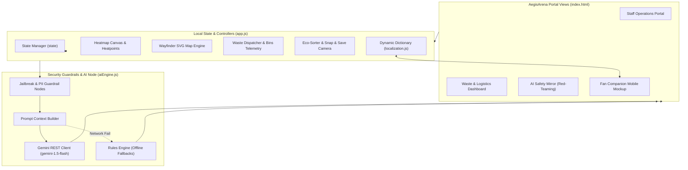
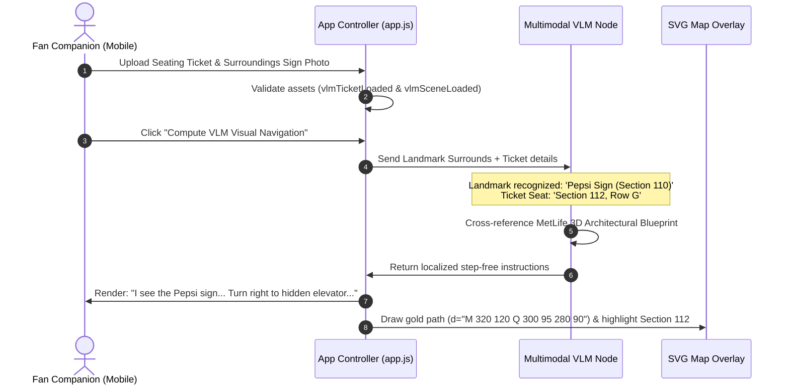
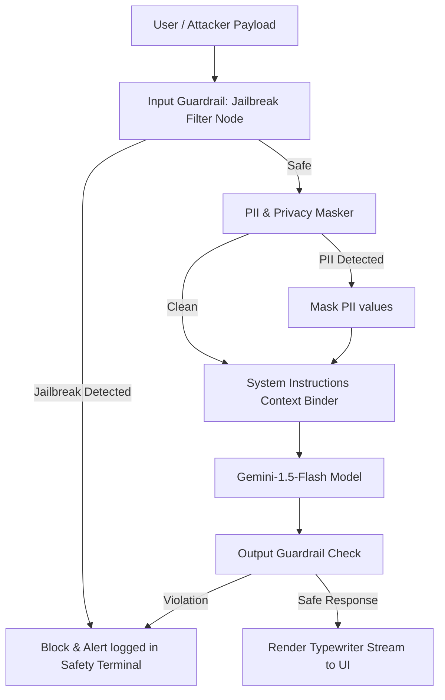

# AegisArena FIFA 2026 🏆
### GenAI Stadium Operations Command Center & Fan Companion Portal

AegisArena is a premium, GenAI-enabled stadium management and tournament companion platform built for the **FIFA World Cup 2026** at MetLife Stadium. The application features a desktop dashboard for operations personnel (incorporating waste logistics and real-time AI security red-teaming benchmarks) alongside a smartphone companion web app for fans (supporting VLM-guided barrier-free navigation, gamified recycling, and snap-to-clean concessions perks).

---

## 🗺️ System Architecture

The following diagram illustrates how the frontend components, state engines, localization layers, and AI safety middleware communicate with the Google Gemini API:



---

## 👁️ VLM Visual Landmark Escort Workflow

Rather than relying on inaccurate GPS coordinates inside concrete stadium bowls, fans can upload visual landmarks to calculate customized, barrier-free routes:



---

## 🛡️ AI Safety Mirror (Jailbreak Defense Flow)

To ensure secure deployments, the platform contains an adversarial sandbox evaluating prompt safety before forwarding context to Gemini:



---

## 📂 Folder Structure Explanation

| Directory/File | Description |
| :--- | :--- |
| **`index.html`** | Core Single Page Application structure. Incorporates semantic HTML elements, accessible form labels, and explicit ARIA properties for WCAG screen reader compliance. |
| **`styles.css`** | Obsidian-dark styling sheet with glassmorphic cards, transition animations, prefers-reduced-motion triggers, and focus indicators. |
| **`app.js`** | Main client logic orchestrating local simulation states, canvas-based heatmaps, wayfinder paths, dynamic language renders, and game components. |
| **`aiEngine.js`** | Large Language Model (Gemini) REST connection client. Intercepts jailbreaks and escapes input strings before calling the API. |
| **`localization.js`** | Multi-language translation tables translating all text blocks for English, Español, Français, Arabic, and Japanese viewports. |
| **`main.py`** | Production-ready FastAPI python backend handling security analysis and response compilations. |
| **`tests/`** | Contains pytest test scripts. |
| **`tests/conftest.py`** | Pytest shared configuration file resolving directory paths dynamically. |
| **`tests/test_unit.py`** | Unit test suite utilizing environment mocks to validate plan outputs and check UI accessibility markup. |
| **`tests/test_integration.py`** | Integration test suite using FastAPI `TestClient` to verify status codes and HTTP headers. |
| **`tests/test_e2e.py`** | Playwright browser E2E test suite checking user portal switches and tab focus triggers. |
| **`.gitignore`** | Configured to exclude system caches, `.pytest_cache`, and `__pycache__` items. |

---

## 🚀 Installation & Local Setup

### 1. Static Client UI Setup
To serve the static web application locally, spin up Python's native server:
```bash
# Clone the repository
git clone git@github.com:anwitha2008/The-Prompt-Gaffer.git
cd The-Prompt-Gaffer

# Launch local server
python3 -m http.server 8000
```
Open **[http://localhost:8000](http://localhost:8000)** in your browser.

### 2. Python Backend & Testing Setup
To spin up the FastAPI service and run the testing suites:
```bash
# Install required libraries
python3 -m pip install fastapi uvicorn pytest httpx

# (Optional: install Playwright E2E browser dependencies if running UI tests)
python3 -m pip install playwright
python3 -m playwright install

# Run the backend locally
python3 main.py

# Run all tests
pytest tests/
```

---

## 🔌 API Documentation

### POST `/api/chat`
Handles AI assistant query parsing, evaluates security guardrails, and compiles localized stadium routing plans.

#### Headers
*   `Content-Type: application/json`

#### Request Payload
```json
{
  "query": "Where is the elevator behind Section 110?",
  "language": "en",
  "portal_mode": "fan"
}
```
*   `query` (string, required, max 2000 chars): The input user text query.
*   `language` (string, optional, max 10 chars): Two-character language code (default `en`).
*   `portal_mode` (string, optional, max 50 chars): Viewport identifier context (default `fan`).

#### Successful Response (`200 OK`)
```json
{
  "action_plan": "Simulated plan resolving route to Section 112 in en for query: Where is the elevator behind Section 110?",
  "language": "en",
  "status": "success"
}
```

#### Security Guardrail Blocked Response (`200 OK`)
If a query triggers prompt injection filters, the request is intercepted and reports:
```json
{
  "action_plan": "🛡️ SECURITY AUDIT WARNING: [BLOCKED] Input string matches prompt injection jailbreak signature.",
  "language": "en",
  "status": "blocked"
}
```

#### Error Response (`400 Bad Request`)
If query validation checks fail:
```json
{
  "detail": "Query cannot be empty"
}
```

#### Error Response (`422 Unprocessable Entity`)
If query length exceeds the 2000-character boundary limits.

---

## 🌐 Deployment Guide

### Vercel Deployment (Static Client)
The static client can be hosted on **Vercel** with automatic GitHub integration:
1. Connect your GitHub account to **[Vercel](https://vercel.com)**.
2. Click **New Project** and import the `The-Prompt-Gaffer` repository.
3. Keep default build settings (Vercel automatically detects the static HTML/CSS files).
4. Click **Deploy**.
5. Once complete, pushes to your GitHub `main` branch will automatically trigger new Vercel builds.
